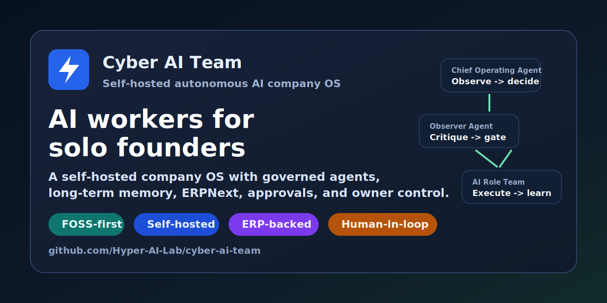
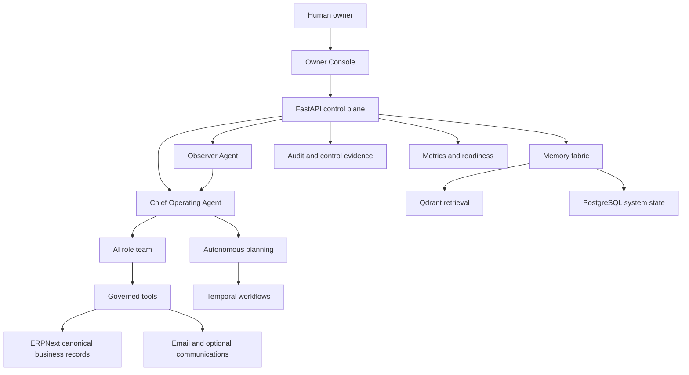

# Cyber AI Team

[](https://github.com/Hyper-AI-Lab/cyber-ai-team/actions/workflows/ci.yml)
[](LICENSE)
[](docker-compose.yml)
[](docs/architecture/autonomous-company-os.md)



**Cyber AI Team is a self-hosted AI company operating system for solo founders, one-person companies, and small digital startups.** It runs a governed team of AI workers around a human owner: a Chief Operating Agent, Observer Agent, company builder, memory steward, finance/accounting, legal, sales, marketing, support, product, engineering, operations, security, research, and communications roles.

The goal is not another chatbot. The goal is a practical open-source foundation for an autonomous digital company: agents can observe company state, recall long-term memory, update canonical business records, propose or create roles, run safe internal actions, and escalate high-impact decisions to the owner.

## The Problem

Solo founders and tiny teams increasingly need the operating surface of a real company: CRM, accounting, project management, customer support, knowledge work, compliance, security, outreach, monitoring, and decision logs. Hiring a full team is expensive, but gluing together many disconnected AI tools creates fragile context, duplicated work, and invisible risk.

Cyber AI Team takes the opposite path:

- **One company memory**, not scattered chat histories.
- **One owner console**, not hidden autonomous actions.
- **One canonical business record**, powered by ERPNext and PostgreSQL.
- **Many specialized AI workers**, coordinated by a governed executive loop.
- **Aggressive autonomy below impact thresholds**, with approval gates for risky or external actions.
- **FOSS-first and self-hosted**, so early-stage founders are not forced into paid SaaS before revenue.

This category is emerging quickly. [Business Insider reported](https://www.businessinsider.com/ai-agents-one-person-companies-china-openclaw-alibaba-president-2026-3) that AI agents are helping drive the rise of "one-person companies" in China, with Alibaba.com leadership estimating that 30-40% of its platform customers are solo entrepreneurs and describing agents as employees for those founders. [PwC's 2025 agentic AI survey](https://www.pwc.com/us/en/tech-effect/ai-analytics/ai-agent-survey.html) found that 79% of surveyed executives were already adopting AI agents and 66% of adopters reported measurable productivity value. Cyber AI Team turns that idea into a self-hosted, inspectable operating system.

## What It Does

| Capability | What Cyber AI Team provides |
| --- | --- |
| Autonomous company orchestration | Chief Operating Agent observes readiness, ERPNext, memory, agents, workflows, approvals, role gaps, KPIs, benchmarks, and owner instructions. |
| Independent critique | Observer Agent reviews governor decisions for weak evidence, goal drift, prompt-injection-style instructions, policy violations, and unsafe assumptions. |
| Dynamic role creation | Company Builder and role backlog detect missing business capabilities and create safe roles or request approval for risky ones. |
| Long-term memory | Four-layer memory fabric: pinned identity, workflow state, retrieval memory with Qdrant, and canonical records in PostgreSQL/ERPNext. |
| Business system of record | ERPNext integration for CRM, accounting, projects, tasks, tickets, procurement, customers, suppliers, leads, opportunities, and invoices. |
| Human-in-the-loop governance | Owner approvals, replay protection, target matching, expiry, consumed-state checks, audit evidence, and readiness gates. |
| Owner console | Next.js console for agents, memory, workflows, chat, approvals, integrations, audit trail, operations readiness, executive cockpit, role backlog, and governor state. |
| Production-shaped operations | Docker Compose deployment, Caddy staging edge, migrations, backup/restore drills, smoke tests, load gate, CI, Trivy image scanning, Prometheus/Grafana-ready observability. |
| FOSS-first resource policy | New tools and dependencies must declare license, cost, self-hostability, hosted-service dependency, data-sharing risk, and free-tier limitations. |

## Architecture



Core stack:

| Layer | Technology |
| --- | --- |
| Backend | FastAPI, SQLAlchemy, Alembic, PostgreSQL, Redis |
| Agent orchestration | LangGraph/CrewAI-inspired role orchestration, governed planning services, Temporal workflows |
| Memory | PostgreSQL, Qdrant, structured memory protocol, operation graph indexing |
| System of record | ERPNext plus PostgreSQL |
| Frontend | Next.js, React, Tailwind CSS |
| Governance | Owner JWT auth, local/OPA authorization, approval records, audit/control evidence |
| Observability | `/health`, `/ready`, `/metrics`, Prometheus/Grafana-compatible configs |
| Deployment | Docker Compose, Caddy edge, staging promotion scripts, backup/restore runbooks |
| Interoperability direction | MCP-style tool contracts and A2A-style agent interoperability surfaces |

## Who This Is For

- Solo founders building AI-native businesses.
- One-person companies that want digital workers without hiring a full staff.
- Small startups that need operational leverage before they can afford a larger team.
- Developers researching multi-agent systems, AI employees, autonomous agents, memory layers, ERP-backed agents, and human-in-the-loop AI governance.
- Teams that want a self-hosted alternative to opaque agent SaaS.

## Quick Start

### 1. Configure

```bash
cp .env.example .env
# Edit .env. At minimum set owner credentials and your LLM provider key.
```

For production-like operation, replace all default secrets, set `OWNER_PASSWORD_HASH`, configure exact CORS origins, keep external side effects approval-gated, and validate integrations before enabling them.

### 2. Start

```bash
# Recommended: managed screen session
./start.sh
screen -r cyber-team

# Or direct Docker Compose
docker compose up --build
```

### 3. Open

| Service | Local URL |
| --- | --- |
| Owner Console | http://localhost:3001 |
| API | http://localhost:8000 |
| API docs | http://localhost:8000/docs |

Sign in with `OWNER_EMAIL` and `OWNER_PASSWORD` from `.env`.

### 4. Build Your AI Company

1. Open the Owner Console.
2. Go to **Agents** and run the Company Builder.
3. Sync ERPNext company context if ERPNext is configured.
4. Review recommended roles in the role backlog.
5. Approve high-risk role/tool grants only when the payload and target are correct.

## Main AI Roles

Cyber AI Team includes role families for:

- Chief Operating Agent / governor
- Observer Agent
- Company Builder
- Supervisor / orchestrator
- Memory Steward
- Finance and accounting
- Legal and policy
- Sales and CRM
- Marketing and PR
- Customer support and success
- Product and project management
- Software engineering and QA
- Operations and procurement
- People and HR
- Security and compliance
- Knowledge and research
- Communications

New roles can be proposed from company context, ERPNext drift, blocked work, role gaps, workflow failures, memory findings, or owner instructions. Low-risk internal roles can be created automatically; side-effectful or high-risk capabilities require owner approval.

## Safety Model

Cyber AI Team is designed for autonomy with explicit control boundaries:

- No fake-success tool execution.
- No external side effects without matching approval in staging/production policy.
- No approval replay, wrong-target approval, expired approval, or consumed approval execution.
- No generated-code hot loading into the live runtime.
- No paid/SaaS-only tool dependency as a readiness blocker under the FOSS-first policy.
- No deletion of audit evidence through normal APIs.
- Prompt-injection-style requests are downgraded to review instead of executed directly.

The owner can inspect decisions, approvals, memory traces, role gaps, tool readiness, workflows, audit events, and governor/observer state from the console.

## Development

```bash
# Backend
cd backend
pip install -e ".[dev]"
pytest

# Frontend
cd frontend
npm install
npm run dev
```

Run the local production-readiness gate before opening a pull request:

```bash
./scripts/quality-gate.sh
```

Heavier checks are available:

```bash
RUN_MIGRATION_REHEARSAL=1 RUN_COMPOSE_SMOKE=1 ./scripts/quality-gate.sh
```

## Documentation

- [Autonomous Company OS architecture](docs/architecture/autonomous-company-os.md)
- [Production readiness plan](docs/production-readiness-plan.md)
- [ERPNext runbook](docs/runbooks/erpnext.md)
- [Backup and restore runbook](docs/runbooks/backup-restore.md)
- [Deployment promotion runbook](docs/runbooks/deployment-promotion.md)
- [Staging promotion runbook](docs/runbooks/staging-promotion.md)
- [Release rollback runbook](docs/runbooks/release-rollback.md)
- [GitHub discoverability notes](docs/visibility/github-discoverability.md)

## Repository Keywords

AI agents, AI agent, agentic AI, autonomous agents, multi-agent system, AI employees, digital workers, one-person company, solo founder, startup automation, company OS, autonomous company, ERPNext, LangGraph, CrewAI, Temporal, Qdrant, FastAPI, Next.js, Docker Compose, MCP, A2A, RAG, long-term memory, human-in-the-loop, owner console.

## Status

This is an active open-source project and a production-shaped reference implementation. The system already includes authenticated owner flows, ERPNext-backed operations, governed role backlog, readiness evidence, CI, staging deployment scripts, backup/restore drills, and safety gates. It is still evolving quickly, especially around the executive governor, observer critiques, adaptive benchmarks, and richer business integrations.

## Contributing

Contributions are welcome if they preserve the core principles: self-hosted, FOSS-first, auditable, owner-visible, approval-gated for high impact, and honest about unavailable tools. Start with [CONTRIBUTING.md](CONTRIBUTING.md).

## License

MIT. See [LICENSE](LICENSE).
